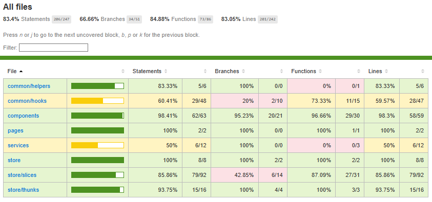

🛍️ Commerce Dashboard (Frontend)

Interfaz web para la gestión de ventas, pagos y entregas, desarrollada como una SPA (Single Page Application) en React + TypeScript + Vite.
Esta aplicación se integra con un backend RSA para la gestión de productos, clientes y transacciones.

🧩 Tecnologías utilizadas
⚛️ ReactJS – librería principal para la construcción del frontend.
🧠 Redux Toolkit – para la gestión centralizada del estado.
⚡ Vite – entorno de desarrollo rápido con soporte TypeScript.
💅 CSS Grid / Flexbox – para el diseño responsive y adaptable.
🧱 TypeScript – tipado estático y robustez en el código.

# React + TypeScript + Vite

# Covertura de pruebas

# Clonar el repositorio

git clone https://github.com/usuario/commerce-dashboard.git

# Entrar al directorio

cd commerce-dashboard

# Instalar dependencias

npm install

# Iniciar el servidor de desarrollo

npm run dev
